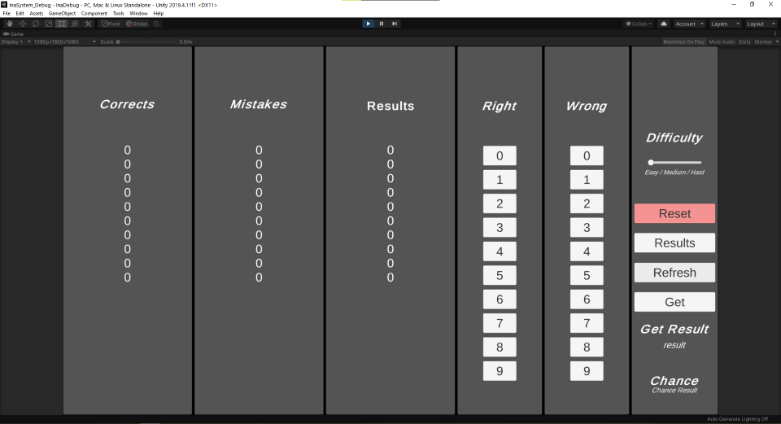

# Debug_InaSystem
Esse é um debug de exemplo de uma implementação de IA para um jogo educacional.

This is a debug example of a simple IA implementation in a educational game.

## Infos 
Você pode encontrar as builds em [Releases](https://github.com/NicolasLucio/Debug_InaSystem/releases)

You can find the build in [Releases](https://github.com/NicolasLucio/Debug_InaSystem/releases)

[Documentation File](Docs/InaDoc.pdf)

## Unity
Unity 2019.4.11.f1

## O que é / What is
“Ina System” foi criado para corresponder com uma matéria da faculdade, junto com o jogo estipulado pela matéria de projeto final. 

"Ina System" was created to coexist with a college grade, together with the game for the final project of the grade.

## Como aplicar / How to apply
O intuito é que ele funcione apenas aplicando quantos itens você quer que sejam analisados na variável pública chamada “howManyIndex”, todos os outros recursos serão criados de forma procedural e através de métodos externos para captar suas informações.

It's reason is to work only adding how much items you want to be analysed in the public variable named "howManyIndex", every others assets will be created procedualy e through the external methods to get infos.

## Utilização / Utility
Ela foi feita para analisar quantos itens foram acertados e quantos itens foram errados, a partir disto, ele irá priorizar em focar em seus erros para que isso influencie o aprendizado do usuário final. 
A partir da escolha da dificuldade (Easy / Medium / Hard), a chance de priorizar o erro aumenta, fazendo que a parte lúdica não seja atrapalhada por possíveis frustrações. 

She was made for analise how much itens you got correct and how much itens you got wrong, with that, she will priorize to focus in yours mistakes to influence the learning of the final users.
With the dificulty choices (Easy / Medium / Hard), the chance to priorize the mistakes will increase, this will made the ludic part not be jumbled with the frustration teor.

## Avisos Importantes / Disclaimer
O nome do sistema e seu ícone foi baseada no personagem Ninomae Ina’nis da Hololive EN, nenhum recurso presente sobre ela nesse sistema foi utilizado por questões monetárias. Todos os direitos reservados.
Esse git serve apenas para visualização de sua utilização, e não para a sua aplicação final.

The system name and your icon was based on Ninomae Ina'nis characters, of HololiveEN, none of this assets (name and icon) was utilized for monetary reasons. 
All rights reserved.
This git serve only for visualization of the system utility, not for you final aplication.
